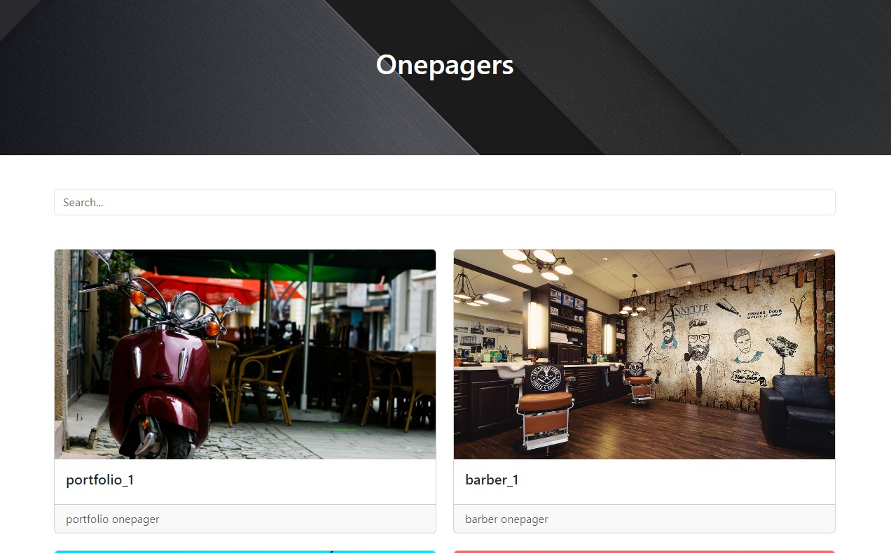

# onepagers - Deprecated

<https://github.com/JackEd0/onepagers>

Demo: <https://op.webrepo.co>

This repository contains lots of onepagers websites.



## Developpers

You can see the sites in its best form by using a server. A great example is the extension `Live Server` on Visual Studio Code.

### Ideas

- Generate a portfolio.
- Try material design and other popular css frameworks.

### For great background images

Search using `bing` for `background for scooter shop`, or even using `bing-ai`.

## Prompts

### Notes

`gpt-4` is the worst, `chatgpt` is the best but doesn't give pictures and `bing-ai` is barebone but give link to realy good pictures.
The best website so far has been done using `chatgpt` with `bootstrap` as a helper. See `scooters\4.html`.

### Prompts text

```text
give me the code for a barber website page. it needs to be futuristic.

the site needs to be responsive, and add placeholder text content to make it fuller. the site needs to show the barber shop address and opening hours.
be more creative and imaginative, give as much visual impact as you can so the site can attract users.
```

```text
give me the html, css and js code for the website page of a business that sells scooters. it needs to be modern.
the site needs to be responsive and work on mobile.
Add placeholder text content to make it fuller.
The site needs to show business address and opening hours.
Be creative and imaginative, give as much visual impact as you can so the site can attract users.

you can use bootstrap to aid in the creation
```
